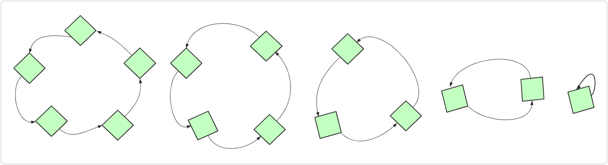

# 利用循环链表求解约瑟夫问题

## 1. 题目概述

**据说著名的犹太历史学家JosephUS 有过以下的故事：**
	在罗马人占领乔塔帕特后，39个犹太人与JosephUS 以及他的朋友躲在一个山洞中，39个犹太人决定宁愿死也不要被敌人抓到，于是决定了一个自杀方式，41个人排成一个圆圈，由第一个人开始报数，每报数到第三个人，这个人就必须得自杀，然后由下一个人报数，直到所有人都自杀身亡为止，聪明的JosephUS 和它的朋友选择站在 31位和16位 ，最终他们逃过一劫~


## 2. 解题思路

这个问题最本质其实就是循环链表的问题，围成一个圈之后，就没有结尾这就是一个典型的循环链表嘛！一个一个顺序报数，那不就是链表的遍历嘛！数到对应数字的出列，这不就是循环链表的删除嘛！




## 3. 代码示例

```c

```


## 4. 编译

```c

```


## 5. 运行方法

``` c

```


## 6. 结果呈现


## 7. 思考

[圆圈中最后剩下的数字](https://leetcode-cn.com/problems/yuan-quan-zhong-zui-hou-sheng-xia-de-shu-zi-lcof/) 

0,1,···,n-1这n个数字排成一个圆圈，从数字0开始，每次从这个圆圈里删除第m个数字（删除后从下一个数字开始计数）。求出这个圆圈里剩下的最后一个数字。

例如，0、1、2、3、4这5个数字组成一个圆圈，从数字0开始每次删除第3个数字，则删除的前4个数字依次是2、0、4、1，因此最后剩下的数字是3。

