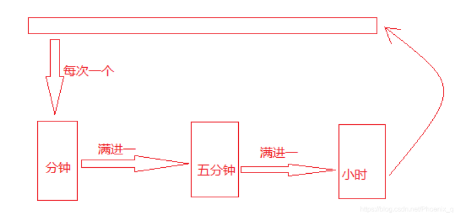

# 球钟问题

## 1. 题目概述

问题描述: 球钟是利用球的移动来记录时间的装置

它有三个可以容纳若干个球的容器：分钟指示器，五分钟指示器，小时指示器。

若分钟指示器中有2个球，5分钟指示器中有3个球，小时指示器中有4个球，则时间为4:17。

每过一分钟，球钟就会从球队列的队首取出一个球放入分钟指示器，分钟指示器最多可容纳4个球。在放进去第五个球的时候，分钟指示器内的4个球就会按照他们被放入时的相反顺序加入球队列的队尾。而第五个球就会进入五分钟指示器。按此类推，五分钟指示器最多可放11个球，小时指示器最多可放11个球。因此，该球种表示的时间范围是从00:00到11:59


## 2. 解题思路

1、要想表示00:00到12：00最少需要多少个球?



想象一下，在11：59的时候，分钟指示器里面有4个球，五分钟指示器有11个球，小时指示器有11个球，则这时三个指示器都为临界状态，共用去26个球，而球钟要求能表示12：00，即可理解为00：00，就是要求能从11：59回到00：00，则还需一个球去触发这个临界状态，类似于多米洛骨牌，这个球依次进入三个指示器，并触发其临界状态，三个指示器里的球依次回到队列，然后最后一个球也回到队列，则最少需要27个球。


2、假设指示器都为空，球队列需要多长时间能回到原来的状态? 即从初始球队列中球的顺序，经过球的循环后球队列中的球再次与初始顺序相同。

这时，要理解，回到原来的状态，并不仅仅是27个球都回到队列就完事了！！而且27个球的顺序要和原来一摸一样。

题中的队列很好理解，队首出队尾进嘛，已经明说了用队列去表示，而三个指示器要求按他们的球放入的相反顺序取出，换句话说，就是后进的先出，先进的后出，就是用三个栈去表示三个指示器。

这里我用的顺序循环队列，然后用了三个链式栈。


## 3. 代码示例

```c

```


## 4. 编译

```c

```


## 5. 运行方法

``` c

```


## 6. 结果呈现


## 7. 思考

如果不用顺序队列和链式栈，怎么做？

