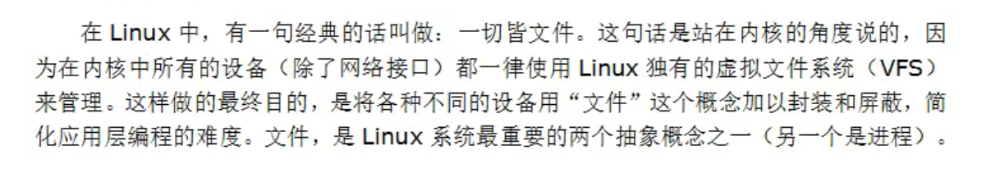
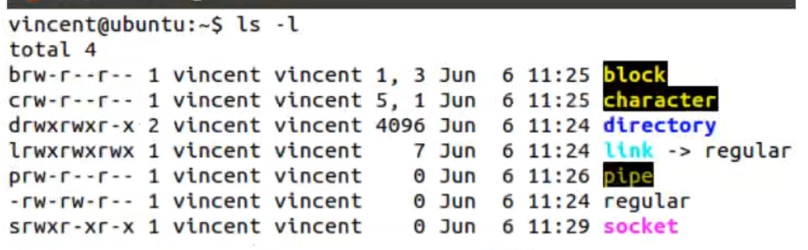
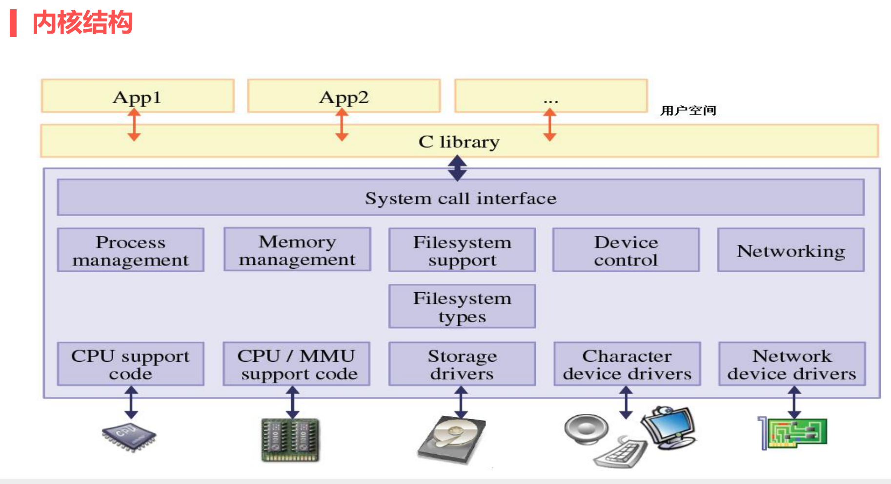

# IO

## 1.文件




## 2.文件类型





## 3.文件IO和标准IO

对一个文件有两种不同的操作方式



1. 文件IO------(linux系统提供)
   系统调用：当我们的应用程序要使用一些底层的功能的时候，不应该自行访问底层，而应该向操作系统发出请求。

   特点：	

   1. 不带缓冲区
   2. 操作系统直接提供的函数接口
   3. 调用系统调用是很耗费资源的


2. 标准IO------(C库提供)

   C库函数：在系统调用接口之上封装的接口，一个C库函数可以封装多个系统调用函数。
   作用: 

   1. 增强了代码的可移植性，复用性
   2. 提高了效率。
      标准IO增加了一个【缓冲机制】 


eg：菜市场和饭店


## 4.标椎IO

**[fopen/fclsoe/fgetc/fputc/fgets/fputs/fread/fwrite]**


```C
#include <stdio.h>

FILE *fopen(const char *path, const char *mode);
   
功能：打开文件

参数：
	path: 文件路径

	mode:
			r  : 以只读方式打开，文件必须存在
      r+ : 以读写方式打开，文件必须存在
			w  : 以写的方式打开，文件不存在，则创建，
        								文件存在，则清空
      w+ : 以读写的方式打开，文件不存在，则创建，
        								文件存在，则清空  
			a  : 以追加的方式打开（可写），文件不存在，则创建。
        									文件存在，则追加在文件的末尾
			a+ : 以追加的方式打开（读写），文件不存在，则创建。
        									文件存在，则追加在文件的末尾

返回值：   
	成功： FILE *fp   流指针
  失败： NULL    
```


FILE *fp = fopen("./1.txt", "w+"); 


FILE：系统会自动为使用的文件在内存中开辟一片空间，来存储该文件的详细信息，这个空间类型为 FILE 结构体类型，该结构体由系统设计。


FILE *：流指针，在标准IO中，每次成功打开一个文件，都会返回一个流指针,这个流指针就描述了一个文件，所有的标准IO都围绕流指针来进行。


//出错处理

strerror(errno);   //参数就是错误码errno

perror("fopen");  //参数就是字符串


同一个文件，可以存在多个流指针，与之对应。

示例：利用标椎IO函数测试当前系统最大能打开的文件个数。


1021+3 = 1024

stdin  ：标椎输入流

stdout：标准输出流

stderr：标准错误流


```c
int fclose(FILE *fp);
功能：关闭文件
参数：
  fp：流指针
```

fclose(fp);


为什么要关闭一个文件？

一、防止其他进程操作这个文件
二、释放结构体占用的资源

在程序结束时，系统自动回收资源（不完全），所以尽量写上fclose。


系统默认打开了3个流指针 

stdin    (标准输入，终端进行输入)

stdout（标准输出，终端打印出来）

stderr（标准错误，终端打印出来）


```c
FILE *freopen(const char *path, const char *mode, FILE *stream);
功能：改变流指针的指向
参数：
	path: 文件路径名
  mode: 打开方式
  stream：流指针
```


fgetc

```c
int fgetc(FILE *stream);
功能：获取一个字节的数据
参数：
  stream: 流指针
返回值：
    
```

fputc

```c
int fputc(int c, FILE *stream);
功能：写入一个字节的数据
参数：
  c: 数据
  stream: 流指针
```


每一个终端都是一个文件: pts/xxx   这个就是终端对应的文件，这个文件的名字是以数字命名的
这个文件存储在 ： /dev/pts/xxx
这些文件是由linux系统自动创建。当打开一个终端时，就会重建一个新的文件与之对应
stdin、stdout、stderr都指向的是同一个文件（终端文件）。


示例：直接向终端写入'x'

ps :查看当前终端运行的进程


**[缓冲区： 行缓存、无缓存、全缓存]**


printf、stdin 、stdout是行缓存，缓冲区大小是 1024byte == 1Kbyte

//1.行缓存满了 或遇到'\n'输出条件

//2.fflush可以强制刷新 (fflush)

//3.文件关闭的时候 fclose(stdout)     

//4.程序结束的时候exit return


无缓存：stderr


全缓存：通过fopen函数打开的流指针，这个流指针fp的缓冲区大小是   4*1024  4Kbyte
//1.缓存区满
//2.fclose(fp)
//3.return 
//4.exit
//5.fflush(fp)


```c
char *fgets(char *s, int size, FILE *stream);
功能：读取一行的数据
参数：
  s: 内存地址  char s[];
	size: 读取的字节数
	stream: 流指针
返回值：
  成功：读取到字符串的首地址
  失败：NULL
```

文件有多少行？


```c
int fputs(const char *s, FILE *stream);
功能：写入一行的数据
参数： 
  s: 内存地址 char s[];
	stream: 流指针
返回值：
  成功：非零值
  失败：-1
```

写入"hello world"


示例：从标椎输入（stdin）得到字符串 写入到 文件当中


练习：复制文件


```c
int fseek(FILE *stream, long offset, int whence);
功能：定位文件指针
参数：
  stream: 流指针
  offset: 偏移量 
			100：向后偏移100个字节
    	-100：向前偏移100个字节
  whence: 基点 
			SEEK_SET: 文件开头
      SEEK_END: 文件末尾
      SEEK_CUR: 文件当前位置
返回值：
    成功：0
    失败：-1
```


定位到文件末尾:   fseek(fp,   0  , SEEK_END);

定位到文件末尾的前一个字节: fseek( fp, -1, SEEK_END );


```c
long ftell(FILE *stream);
返回值：当前文件指针的位置
```

获取文件大小


```c
void rewind(FILE *stream);
功能：文件指针返回到文件开头
```


作业：查单词

流程：

  1.打开文件

2. 循环
3. 输入一个单词
4. 遍历文件 
5. 打印出单词信息
6. 重新开始查询
7. 关闭文件


