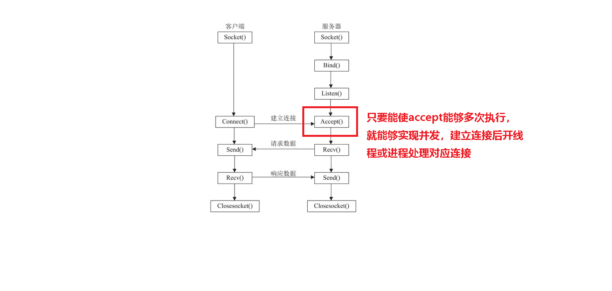

# 网络编程

## 一、TCP编程的API

### socket:

> > ```
> > int socket(int domain, int type, int protocol);
> > 返回值：> 0 代表函数调用成功，这个值是一个文件描述符
> > 		< 0 代表函数调用失败
> > int domain：地址簇 AF_INET：IPv4 AF_INET6: IPv6 
> > 
> > int type: 套接字类型 SOCK_STREAM：流式套接字   唯一对应TCP 
> > 		             SOCK_DGRAM:  数据报套接字 唯一对应UDP
> > 					 SOCK_RAW:    原始套接字   针对较低层次协议
> > 
> > int protocol： 默认为0 	
> > ```

### bind:

> >```
> >/*绑定通信IP和端口*/
> >struct sockaddr_in {
> >              sa_family_t sin_family; /* 地址族: AF_INET 2字节 */
> >              u_int16_t sin_port; /* 按网络字节次序的端口 2字节*/
> >              struct in_addr sin_addr; /* internet地址 */
> >              };
> >
> >              /* Internet地址. */
> >              struct in_addr {
> >              u_int32_t s_addr; /* 按网络字节次序的地址 */
> >              };
> >struct sockaddr_in sddr;
> >bzero(&sddr, sizeof(sddr)); //将sddr做清0操作
> >
> >uint16_t htons(uint16_t hostshort);
> >把本机字节序转为网络字节序
> >uint16_t ntohs(uint16_t netshort);
> >把网络字节序转为本机字节序
> >
> >int bind(int sockfd, struct sockaddr *my_addr, socklen_t addrlen);
> >返回值：成功 0
> >        失败 -1
> >int sockfd: 				代表socket成功返回的文件描述符
> >struct sockaddr *my_addr ： 要绑定的IP和端口
> >socklen_t addrlen ：        要绑定的IP和端口的结构体的大小
> >```
> >
> >

### listen:

> >```
> >int listen(int s, int backlog);
> >返回值：		成功 0
> >				失败 -1
> >int s:  		socket打开的文件描述符
> >int backlog :	允许监听的套接字队列元素的最大个数 （数目和性能产生联系）
> >```
> >
> >

### accept:

> >```
> >int accept(int s, struct sockaddr *addr, socklen_t *addrlen);
> >返回值：				失败 -1
> >						成功 非负整数
> >int s: 					socket返回的文件描述 
> >struct sockaddr *addr： 存储连接进来的客户端的IP和端口 （NULL不关注客户端的信息）
> >socklen_t *addrlen：	结构体的大小
> >
> >```
> >
> >

### connect:


```
int connect(int sockfd, const struct sockaddr *addr,socklen_t addrlen);
返回值：				成功 0
						失败 -1
int sockfd：    		socket返回的文件描述符
struct sockaddr *addr： 要连接的服务器的IP和PORT
socklen_t addrlen：		存储要连接服务器IP和PORT的结构体的长度

```

### read函数的返回值分析

>>返回值为 -1 ：read发生错误
>>
>>返回值为0   ：表示另外一端掉线
>>
>>返回值大于0：表示实际读取到的字节数  
>>
>>注意：如果处于连接状态，且缓冲区没有内容，read会阻塞


### send:

发送数据，专属网络编程

```
ssize_t send(int sockfd, const void *buf, size_t len, int flags);
int sockfd		: 发送的目标套接字的文件描述符（对象）
const void *buf	: 要发送的内容缓冲区的首地址
size_t len		: 要发送内容的大小（字节为单位）
int flags		: 为0效果和write一摸一样（绝大多时刻选择参数）
				  为MSG_DONTWAIT时，它是非阻塞模式
ssize_t			: >0 表示实际发送的字节数
				: -1 表示发送失败
```


### recv:

发送数据，专属网络编程

```
ssize_t recv(int sockfd, void *buf, size_t len, int flags);
int sockfd		: 接收数据对象的文件描述符
const void *buf	: 接收数据存储的缓冲区首地址
size_t len		: 期望要接收内容的大小（字节为单位）
int flags		: 为0效果和read一摸一样（绝大多时刻选择参数）
				  为MSG_DONTWAIT时，它是非阻塞模式
ssize_t			: >0 表示实际接收的字节数
				: -1 表示接收失败
				: 0  表示另外一端退出或者关闭或者掉线
```

### sendto:

> > UDP编程使用的发送函数

```
ssize_t sendto(int sockfd, const void *buf, size_t len, int flags,
                      const struct sockaddr *dest_addr, socklen_t addrlen);
int sockfd						: 发送的目标套接字的文件描述符（对象）
const void *buf					: 要发送的内容缓冲区的首地址
size_t len						: 要发送内容的大小（字节为单位）
int flags						: 默认为0
const struct sockaddr *dest_addr: 发送的对象（对象的IP PORT）
socklen_t addrlen:				: 上一个参数的长度
ssize_t							: >0 表示实际发送的字节数
								: -1 表示发送失败                     
```


### recvfrom:

> >UDP编程使用的发送函数

```
ssize_t recvfrom(int sockfd, void *buf, size_t len, int flags,
                        struct sockaddr *src_addr, socklen_t *addrlen);
int sockfd					: 接收数据对象的文件描述符
const void *buf				: 接收数据存储的缓冲区首地址
size_t len					: 期望要接收内容的大小（字节为单位）
int flags					: 默认为0
struct sockaddr *src_addr	: 发送方的信息（IP PORT）
socklen_t *addrlen			: 上一个参数的长度
ssize_t			: >0 表示实际接收的字节数
				: -1 表示接收失败                     
```


## 二、TCP服务器的模型

### 1、循环服务器

```
socket(...);
bind(...);
listen(...);
accept(...);
while(1){
	read(...);
	...
	write(...);
}
TCP循环服务器用的相对较少
```

### 2、并发服务器

> > 并发服务器实现原理是多次调用accept函数
> >
> > 

> > 多线程实现并发

```
socket(...);
bind(...);
listen(...);
while(1){
	accept(...);
	pthread_create(...); //创建线程处理新的链接
}

```

> > 多进程实现并发
> >

```
socket(...);
bind(...);
listen(...);
while(1){
	accept(...);
	fork(...); //创建子进程处理新的链接
}
记得回收子进程，否则会出现僵尸进程
```


## 三、作业

> > 完成多线程并发服务器的文件传输功能